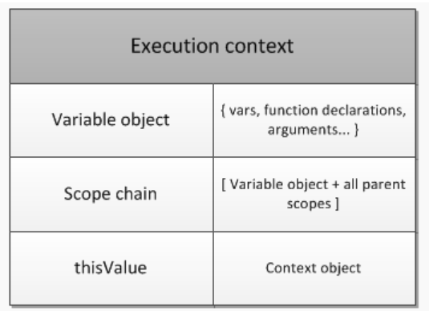

# 실행 컨텍스트(Execution Context)

실행 가능한 코드를 형상화하고 구분하는 추상적인 개념으로, 실행 가능한 코드들이 실행되기 위해 필요한 환경을 의미한다.

 

### 실행 가능한 코드

* 전역 컨텍스트(Global Context)

* 함수 컨텍스트(Function Context)

* Eval 컨텍스트

> 이 중 Eval 컨텍스트는 수 많은 취약점이 있어 사용하지 않는다.

 

실행 컨텍스트는 `실행에 필요한 정보`를 형상화하고 구분할 때 물리적으로 객체의 형태를 가진다.

 

### 실행 컨텍스트 구조
 

 
 

### 실행에 필요한 정보

* 변수 객체 (전역변수, 지역변수, 매개변수, 객체의 프로퍼티)

* 스코프 체인(Scope Chain)

* this

 

 

## 변수 객체(Variable Object/VO)

실행에 필요한 여러 정보들을 담고 있는 객체
코드가 실행될 때 엔진에 의해 참조되며 코드에서는 접근할 수 없다.

### 변수 객체가 담는 정보

* 변수

* 매개변수(parameter)와 전달인자(arguments)

* 함수 선언(함수 표현식은 제외)

 

> <b>전역 컨텍스트일 경우</b> 
VO는 모든 전역 변수와 전역 함수 등을 포함하는 전역 객체(Global Object/GO)를 가리킨다.

 

> <b>함수 컨텍스트일 경우</b> 
VO는 지역 변수와 내부 함수 등을 포함하는 활성 객체(Activation Object/AO)를 가리키며 AO는 GO와 달리 매개변수와 전달인자들의 정보를 배열의 형태로 담고 있는 Arguments Object가 추가된다.

 

    Arguments 객체는 함수 컨텍스트 내부에 암묵적으로 생성되는 객체로, 함수에 전달된 인수가 담겨있는 Array 형태의 객체이다.

