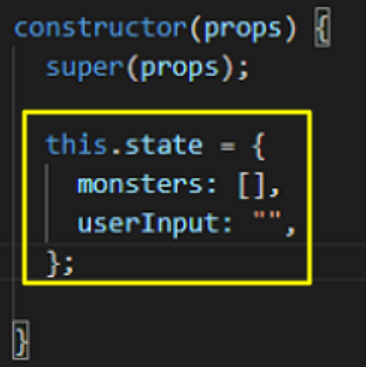
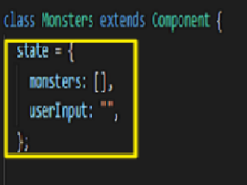
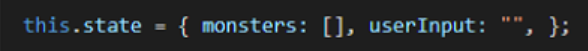
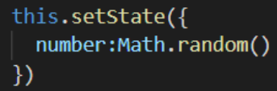
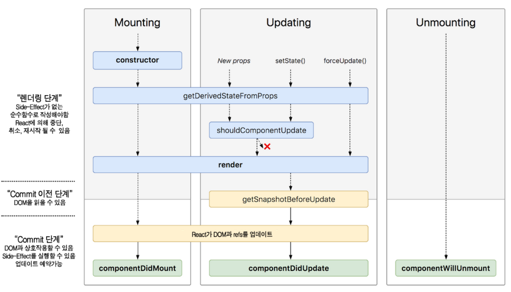

# Class Component

현재는 자주 사용되지 않지만 이전에 만들어진 프로젝트들의 유지보수를 위해서 알고 있어야 한다

<b>기본 선언 방식</b>

    import React, { Component } from "react";

    class App extends Component {
        constructor(props) {
            super(props);
            this.state = {
                //...
            }
        }

        render() {
            return(
                //...
            );
        }
    }

    export default App;

<b>필수 요소</b>

- class 키워드 필요
- Component로 부터 상속
- render() 메소드 반드시 필요

<b>특징</b>

- 메모리 자원을 Function Component보다 조금 더 사용한다
- 표현 방법이 조금 더 명시적이고, Function Component보다 기능이 약간 더 많다
- 임의의 메소드를 정의할 수 있다
- state와 lifeCycle 기능을 사용할 수 있다

 
 

## <b>State</b>

컴포넌트 내부에서 바뀔 수 있는 값

> constructor(생성자) 안에서 _this.state_ 초기 값 설정 가능  
>
>   

> constructor(생성자) 없어도 바로 _state_ 초기 값 설정 가능  
>
>  

> Object 형식으로 사용  
>
>  

> this.setState() 메소드로 state 값 변경 가능
>
> 

  

## <b>LifeCycle</b>

React는 Component라는 UI단위를 통해 화면에 랜더링을 하는데, 이때 LifeCycle(생명주기)를 따른다

  

### <b>Mounting(마운트 단계: 생성)</b> 

Component가 처음 생성되는 단계 
Component가 실행되고 결과물로 나온 Element들이 가상 Dom에 삽입되고 실제 Dom을 업데이트하기까지의 과정 

- <b>Constructor(생성자 메소드)</b> 

  > 프로그램이 만들어지는 과정에서 가장 먼저 실행되는 함수 
  > this.state의 초기값 설정 또는 인스턴스에 이벤트 처리 메소드를 바인딩하기 위해 사용됨

        constructor(props) {
            super(props); // 반드시 super(props)를 가장 먼저 호출해야함
        }

 

- <b>render()</b> 
  > Component를 랜더링 하는 메소드 
  > Class Component의 필수 요소

 

- <b>componentDidMount()</b> 
  > Component가 Mount된 직후, 즉 트리에 삽입된 직후에 호출된다 
  > 해당 메소드가 호출되는 시점은 Component가 화면에 나타난 시점이다 
  > setState 메소드는 Mount 이후에 동작하기 때문에 API 호출을 통해 받아올 때 등 사용하면 좋다

 

### <b>Updating(업데이트 단계)</b> 

Component의 props 또는 state가 바뀌었을 때 실행되는 단계

- <b>componentDidUpdate</b> 
  리랜더링이 완료된 후에 실행되는 메소드 

        componentDidUpdate(prevProps, prevState, snapshot) {
            //...
        }

 

### <b>Unmounting(제거 단계)</b> 

- <b>componentWillUnmount</b> 
  Component가 해제되어 DOM에서 제거될 때 호출되는 메소드 

      componentWillUnmount() {
        //...
      }

  > Unmounting 단계에서는 더이상 랜더링이 되지 않기 때문에 componentWillUnmount() 내에서 setState()를 호출하면 안 된다 
  > 주로 DOM에 직접 등록했었던 이벤트를 제거하거나 이전에 사용했던 타이머 제거, 외부 라이브러리 인스턴스 제거를 위해 사용
